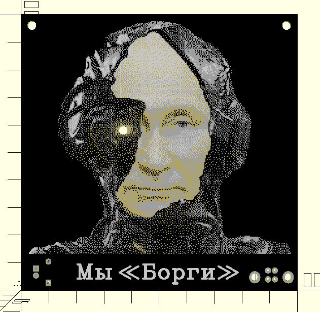
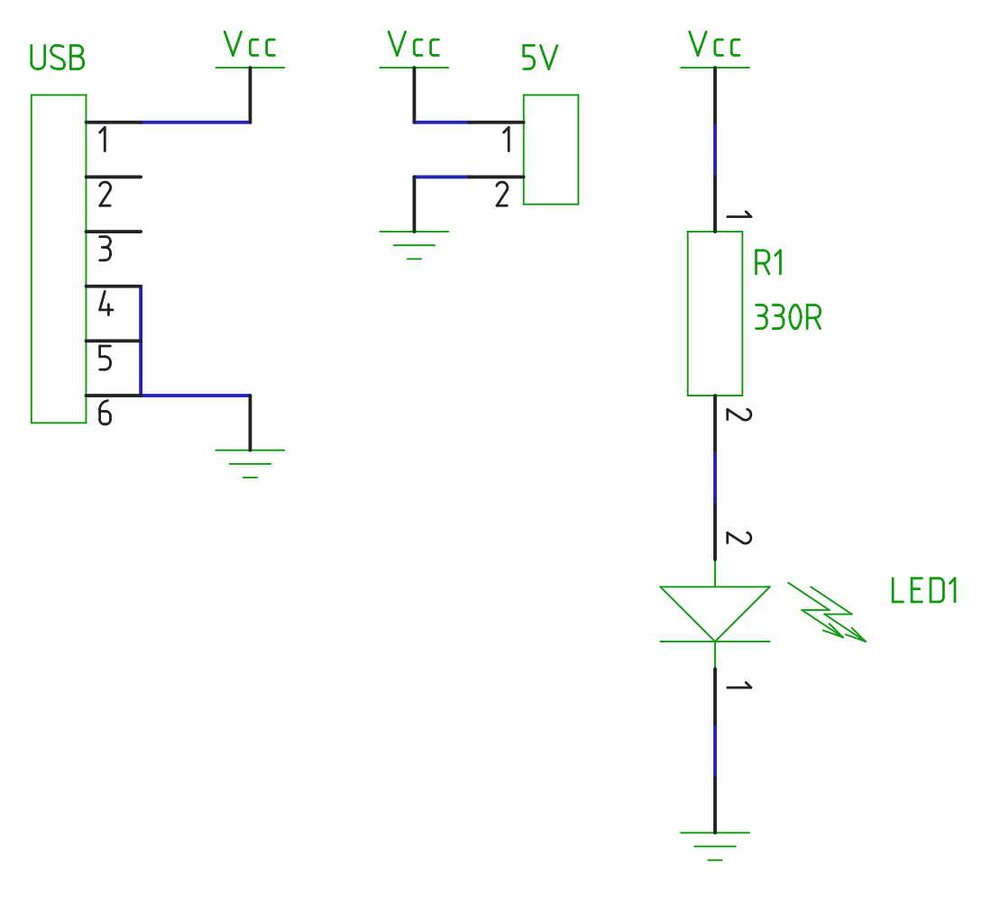

# STEM4ukraine-We-Are-The-Borg

Build this fun project to reflect on the essence of russian imperialism.

A simple and fun school STEM project demonstrating simple through hole soldering and analogue electronics using USB to power the circuit.

The circuit is very simple, using a resistor and USB power to drive the Borg's red eye.

Mounting holes at the top corner make it easy to decorate your office, classroom or home!

The prototype is currently undergoing manufacturing and testing

An openscad render of the front of the PCB:

The circuit schematic; simplicity itself:

